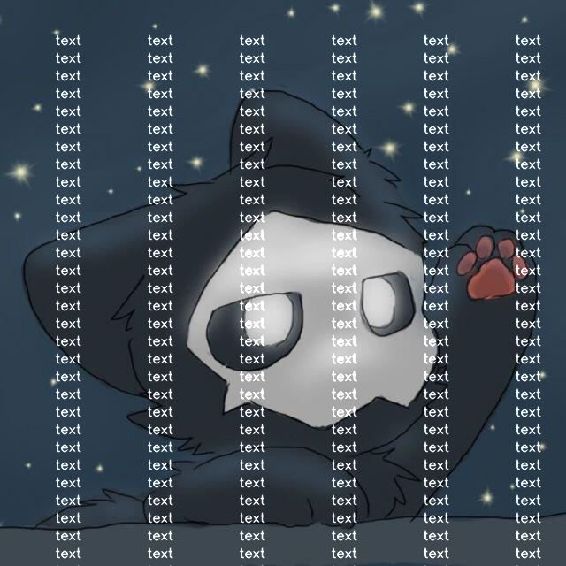
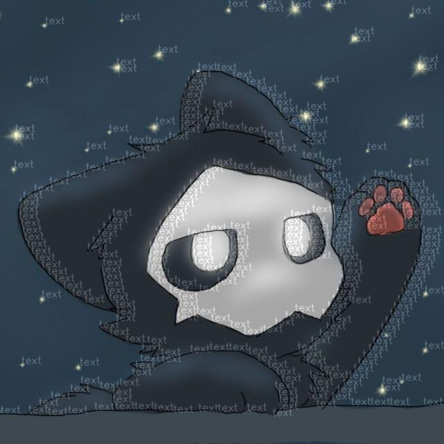

# miaoWM.js: 在线轻量化水印工具

> 小提示：miaoWM.js 的核心代码与编译教程已经放在了 `core-build` 目录中了，有自定义需求的请自取哈
> 
> 如果 `release` 中编译好的文件不适合你，可以尝试更改一下 `webpack.config.js` 中的 `libraryTarget` 参数

## 介绍

miaoWM.js 是一个基于openCV的轻量化在线水印工具，使用了wasm技术使openCV运行在浏览器上

## 特性

- **轻量化**: 文件打包后大小仅有2.4M 可方便的集成到各种支持wasm的环境中
- **速度快**: 加载平均耗时30ms, 图片生成500ms~700ms  (生成速度随图片分辨率增加而增加)
- **质量高**: 使用openCV处理图片 支持无透明度图片转化
- **🎉支持中文🎉**: 使用了Freetype字体，支持水印为中文（感谢stackoverflow上大佬的代码）

>  来画个饼 增加盲水印功能

## 效果
图片来源于网络 如果侵权，请联系删除（issue）

| 类型 | 之前 | 之后 |
| --- | --- | --- |
| 普通水印 |      |  
| 全屏水印 |      |  
| 线稿描边 |      |  
| 中文显示 |      |  

## 如何使用？

Worker 导入
```js
const worker = new Worker("miaoWM.worker.js");
worker.onmessage = function (params) {
    console.log(params);
}c
```

可用模式
```js
// ***所有数据在onmessage中返回***

// 初始化内核
worker.postMessage({ command: "init" });

// 获取系统的版本
worker.postMessage({ command: "getVersion" });
// 返回：内核版本和openCV版本
// 样例：{coreVersion: 'release-v1.0.0', openCVVersion: '4.5.1'}

// 设置文件（图片，字体）
// isFont bool值 用于确定上传的是图片还是字体 不传默认图片
worker.postMessage({ command: "setFile", data: { fileData, isFont } });

// 举个例子
axios.get("example.png",{params: {}, responseType: 'arraybuffer'}).then((res)=>{
    worker.postMessage({ command: "setFile", data: { fileData: new Int8Array(res.data), isFont: false } }); // PID 为用于确定图片的唯一识别码
})

// 来设置个字体
axios.get("example.ttf",{params: {}, responseType: 'arraybuffer'}).then((res)=>{
    worker.postMessage({ command: "setFile", data: { fileData: new Int8Array(res.data), isFont: true } }); // FID 为用于确定字体的唯一识别码
})

// 普通水印
// fontID： 字体唯一识别码
// picID： 图片唯一识别码
// text： 水印内容
// color：水印颜色 格式：{0-255},{0-255},{0-255} 标准RGB色值
worker.postMessage({ command: "simpleWatermark", data: { fontID, picID, text, color } });

// 全屏水印
// fontID： 字体唯一识别码
// picID： 图片唯一识别码
// text： 水印内容
// color：水印颜色 格式：{0-255},{0-255},{0-255} 标准RGB色值
worker.postMessage({ command: "fullScreenWatermark", data: { fontID, picID, text, color } });

// 线稿描边
// fontID： 字体唯一识别码
// picID： 图片唯一识别码
// text： 水印内容
// color：水印颜色 格式：{0-255},{0-255},{0-255} 标准RGB色值
// gain：0-1 水印增益 调整水印深浅 防止水印过多遮挡原画面
// fontSize：字体大小 0-100 调整字体大小
worker.postMessage({ command: "edgeWatermark", data: { fontID, picID, text, color, gain, fontSize } });
```

## 问题

如有其他问题或发现bug，请通过issue告诉我

## 厚颜无耻求个Star
如果你喜欢这个项目，能不能点个免费的Star呢~
